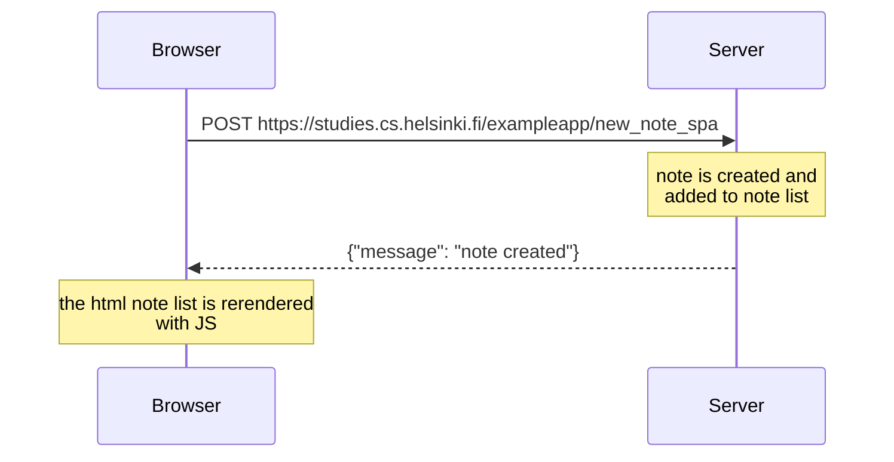

```mermaid
sequenceDiagram
    Browser ->> Server: POST https://studies.cs.helsinki.fi/exampleapp/new_note_spa
    Note over Server: note is created and <br> added to note list
    Server -->> Browser: {"message": "note created"}
    Note over Browser: the html note list is rerendered <br> with JS
```
