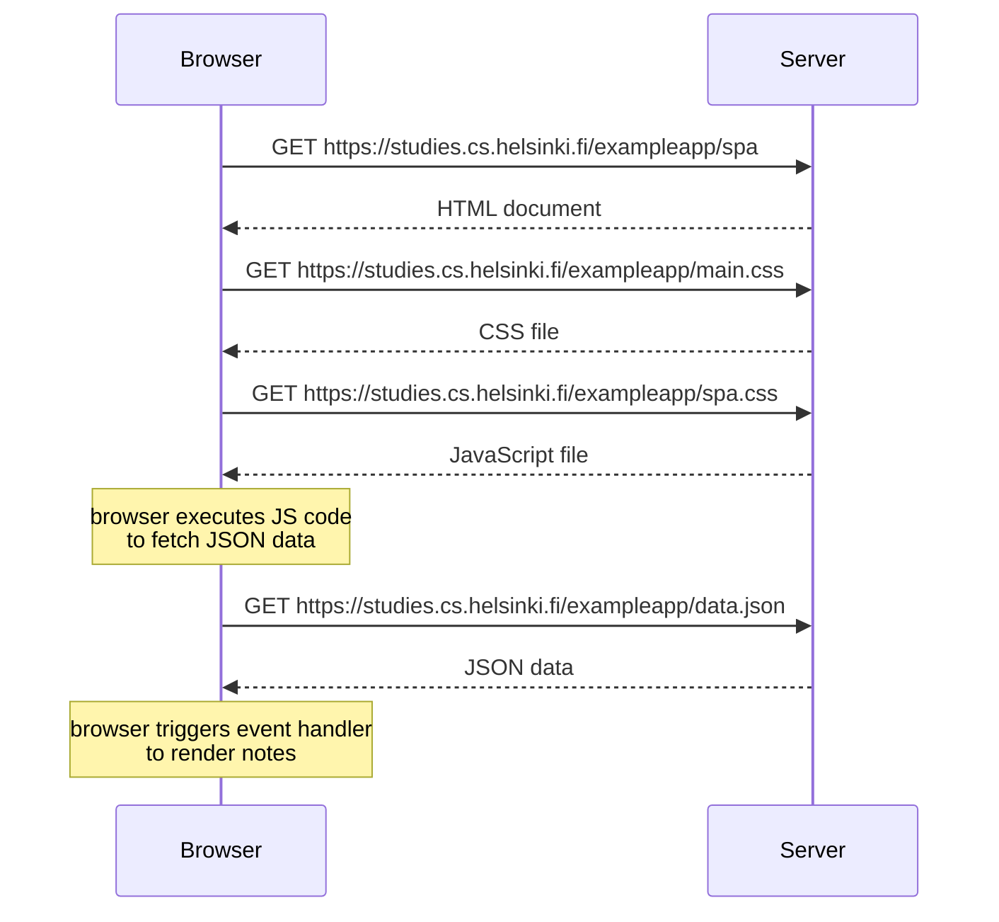

```mermaid
sequenceDiagram
    Browser ->> Server: GET https://studies.cs.helsinki.fi/exampleapp/spa
    Server -->> Browser: HTML document
    Browser ->> Server: GET https://studies.cs.helsinki.fi/exampleapp/main.css
    Server -->> Browser: CSS file
    Browser ->> Server: GET https://studies.cs.helsinki.fi/exampleapp/spa.css
    Server -->> Browser: JavaScript file
    Note over Browser: browser executes JS code <br> to fetch JSON data
    Browser ->> Server: GET https://studies.cs.helsinki.fi/exampleapp/data.json
    Server -->> Browser: JSON data
    Note over Browser: browser triggers event handler <br> to render notes
```
